## 10 Years of Vocaloid Producers - Miku's 10th

Natalie.mu, August 31st, 2017 ([Original Article](http://natalie.mu/music/pp/miku_enquete))

On August 31st, 2017, Hatsune Miku celebrates her bright tenth birthday. For the fourth part of our series, we surveyed 34 Vocaloid producers, and they told us their thoughts on Hatsune Miku and the Vocaloid songs that left an impression on them.

* * *

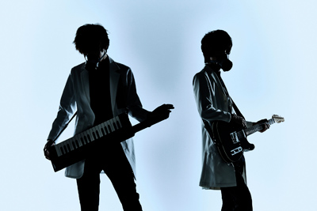  
out of service  
*Known for: "M'AIDER Disaster Girl"*

- About Hatsune Miku

Congratulations on your 10th anniversary!  
Hatsune Miku was my first introduction into Vocaloid.  
I'm very grateful for the countless songs she's sung over the years! Please, keep giving your all to carry the world of Vocaloid!

- What's your favorite Vocaloid song?

FREELY TOMORROW.

I love the song, of course, but it was shocking at the time to see a Vocaloid song with such incredible vocal tuning!  
This song helped me to believe that Vocaloid has no limits, and I feel it broadened the horizons of my work.  
I was extremely happy when I got the album this song is on autographed by its creator, Mitchie M.

[FREELY TOMORROW](http://www.nicovideo.jp/watch/sm15172108)

* * *

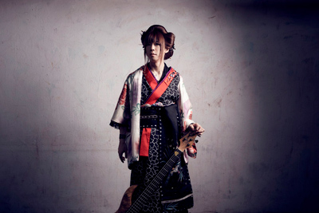  
Asa (Wagakki Band)  
*Known for: "Yoshiwara Lament"*

- About Hatsune Miku

Happy 10th anniversary to Hatsune Miku!  
I first listened to a Miku song when I was a student.  
I remember being very excited at the time that there was something so neat as this.  
Now let's go for 20 years!

- What's your favorite Vocaloid song?

The song that sticks in my memories most is livetune's Packaged.  
I was astounded to learn you could make something like this with Hatsune Miku.  
In part, listening to this song lit a fire under me to create songs with Hatsune Miku.

In addition, I have to say Melt and Black☆Rock Shooter left strong impressions on me.

[Packaged](http://www.nicovideo.jp/watch/sm1136355)

* * *

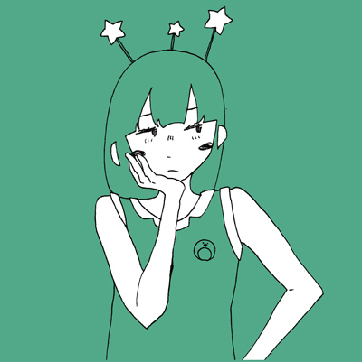  
Ishifuro (Contemporary Life)  
*Known for: "Yurufuwa Jukai Girl (Easygoing Jukai Girl)"*

- About Hatsune Miku

Congratulations on your 10th anniversary.  
Just how many creatives have you lifted up by serving as such a superb interface for at-home composers to post songs?  
Imagining that, I feel like you couldn't tell the musical history of Japan's shut-ins without her.  
Please, continue to give chances to the young and talented.

- What's your favorite Vocaloid song?

The first I listened to was Double Lariat by Agoaniki.  
It was the song that made me decide that if there were such amazing songs in this world, I'd like to throw myself into it as well.

[Double Lariat](http://www.nicovideo.jp/watch/nm6049209)

* * *

  
164  
*Known for: "A Born Coward"*

- About Hatsune Miku

I first learned of Vocaloid in 2008.  
I was thinking "I'm gonna do music on my own" at the time, but couldn't sing myself, so I encountered it while searching for a way to make do.  
So it just clicked together, like a fateful event that happens once in a million years when all the planets in the solar system are aligned.  
I was like, "this was made for me!" (laughs)

Among the many voicebanks, regardless of sales or of quality, I don't think any Vocaloid has yet surpassed Hatsune Miku in terms of "just put in the melody and lyrics, and she'll sing it for you."  
That's just how polished she feels - a prime Vocaloid who's pretty listenable even without any special work.  
I think it's because of that low barrier and level of polish that new users continue to multiply.

Currently, I don't have many chances to use Hatsune Miku for main vocals, and I do a lot of work that's not directly related to Vocaloid, but on rare occasion I use it for temp vocals, and sometimes in Vocaloid songs, I have Gumi as main but Hatsune Miku doing harmony. Like in A Born Coward, for instance.  
I believe the two groups who constructed the foundations of this scene - I would even call it its culture - are the people who listened to its songs, and Hatsune Miku.  
As someone in the Vocaloid scene, I have these ten years of history, but I personally can't wait to experience new culture as years and years go by, and look forward to future developments. Once again, congratulations on 10 years.

- What's your favorite Vocaloid song?

I have far too many favorite songs, really, but since I make songs too, my favorite songs are honestly my own, so I'll exempt those. (laughs)  
It may technically not be considered a "Vocaloid song," but I'd say yuukiss's cover of Dearest (original by Ayumi Hamasaki).  
I was moved by the tuning that could be mistaken as human, and felt it was the future - listening to this song made me decide to buy Hatsune Miku.  
If it weren't for this video, I'm sure I wouldn't be here now.

[Dearest (Cover)](http://www.nicovideo.jp/watch/sm3225391)

* * *

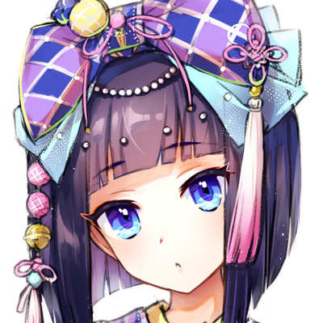  
iroha (sasaki)  
*Known for: "Meltdown"*

- About Hatsune Miku

Ten years already. Time really flies. Many congratulations, Miku-chan!! I made my Vocaloid debut song "moon" less than a month after Miku was sent into the world, so we met surprisingly quickly. I still remember to this day how I bought Miku at the store, made "moon," and then was hit by a double whammy of PC failure and losing my Miku disk. And so at the end of that year, I went out and got Miku back alongside Rin and Len who were just released. So my Miku (V2) is second-generation. That story aside, now that Miku-chan's name roars throughout the world, it makes me really nostalgic to remember how back when she was just getting started, I wondered "should I offer her some flowers?" Congratulations on 10 years!!

- What's your favorite Vocaloid song?

I'm really at a loss on deciding my favorite, since there are a lot of songs I like to about the same degree. But if I must offer one here, it's baker's "carol." Specifically, I'm referring to the version that didn't have a title yet, the prototype of that song, but I like both anyway. (laughs) I think "carol" was the first Vocaloid song I heard online. I was captivated by the unique poppiness of it. If I hadn't encountered this song, I think I would be much, much later to take an interest in Vocaloid. After hearing this song, I swiftly purchased Miku and got to work on my debut song "moon."

[carol](http://www.nicovideo.jp/watch/sm3111123)

* * *

  
Utata-P  
*Known for: "This is the Happiness and Peace of Mind Committee."*

- About Hatsune Miku

Congratulations on Hatsune Miku's 10th anniversary! Which means it's also the 10th anniversary of "Utata-P"!

- What's your favorite Vocaloid song?

For a variety of reasons, I simply have to say my favorite is "This is the Happiness and Peace of Mind Committee." After all, I consider this song to have changed my life.

[This is the Happiness and Peace of Mind Committee.](http://www.nicovideo.jp/watch/sm18100389)

* * *

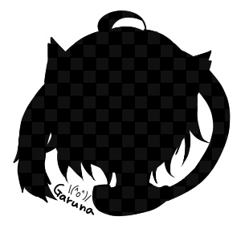  
Owata-P  
*Known for: "Paradichlorobenzene"*

- About Hatsune Miku

Congratulations on Hatsune Miku's 10th anniversary. I debuted as a Vocaloid producer in April 2008, and I can at least say that if she didn't exist, I probably wouldn't have kept music as an interest for such a long time. I became connected with people I would've never come to know from living as an ordinary working adult, and I'm sure it expanded my knowledge, and gave me a lot of fun times. I still don't know what will happen in the next ten years, or if I'll be able to keep going without getting tired of it, but I'll make the most of "not knowing," and I hope to continue on to the next step. Thank you very much.

- What's your favorite Vocaloid song?

OSTER project's Miracle Paint was the first song to leave an impression on me that I properly recognized as a Vocaloid song, so it's the one I'm most attached to. At the same time, I felt infinite possibility in the music video, and it made me want to leap into that world myself. It's still a precious memory now.

[Miracle Paint](http://www.nicovideo.jp/watch/sm1588476)

* * *

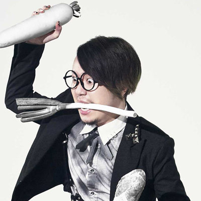  
Giga-P (REOL)  
*Known for: "Gigantic O.T.N"*

- About Hatsune Miku

Congrats on Miku's 10th! ☆ミ And y'know, our meeting was in high school, so that's really somethin', huh! (laughs)  
Wouldn't've done music if you wasn't around, nope! Super gratitude storm! (storms)  
Even so, she's still 16, so. So keep at 'er! ☆

- What's your favorite Vocaloid song?

"\[Hatsune Miku/Rin/Len/Luka\] Dream's Continuation."  
There are so many good songs, I can't decide on a favorite, but I like all of Dixie Flatline's songs, and this is the one I've listened to most.  
I didn't compose at the time, but as I listened to it, I thought "I wanna make a song like this too!"

[Dream's Continuation](http://www.nicovideo.jp/watch/sm7911934)

* * *

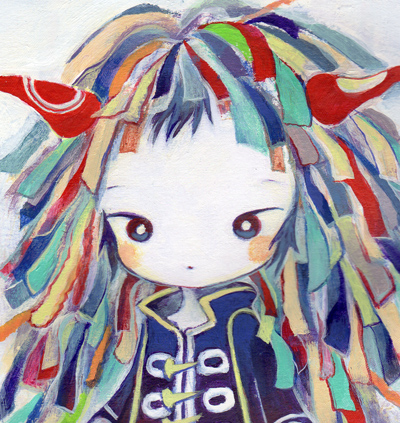  
Kikuo  
*Known for: "Don't Look At Me That Way"*

- About Hatsune Miku

Congratulations. You're very cute.

- What's your favorite Vocaloid song?

Drain (by Treow). For years and years, it's remained etched into my heart and never faded!

[Drain](http://www.nicovideo.jp/watch/sm8132511)

* * *

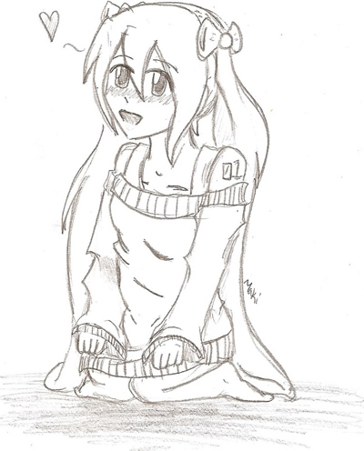  
Crusher-P  
*Known for: "ECHO"*

- About Hatsune Miku

I became interested in Vocaloid right after Hatsune Miku's debut, when I was 12 years old. Being able to grow side by side with Miku has been a special, amazing experience for me. If it weren't for her, I would have never tried to write music at all in the first place.

- What's your favorite Vocaloid song?

My favorite Vocaloid song of all time is World's End Dancehall by wowaka. I hadn't known much by wowaka at the time other than Rolling Girl, which I also did like. However, I became a true fan after hearing the chorus of the song. Since then, I get excited for every chorus of his songs I hear. I've been listening to Unknown Mother Goose nonstop lately!

[World's End Dancehall](http://www.nicovideo.jp/watch/sm10759623)

* * *

  
Kurousa-P  
*Known for: "Senbonzakura (One Thousand Cherry Trees)"*

- About Hatsune Miku

First of all, congratulations on your 10th anniversary!  
I've been listening from the beginning, so it's deeply moving to think how quickly time has passed.  
I think it's a very arduous task to preserve a single thing for 10 long years.  
Even as generations change, I wish for it to continue to take root as part of our culture!

- What's your favorite Vocaloid song?

There are many, but I'll have to submit the first song I listened to, Miku-Miku ni Shite Ageru.  
If it weren't for this song, perhaps things wouldn't have risen to such heights.  
At the same time, this song was exposed to various copyright issues, which were resolved by many people over a long period.  
Personally, it makes me think about a lot of things, so it stays with me.  
But enough about that - I really like it! (laughs)

[Miku-Miku ni Shite Ageru](http://www.nicovideo.jp/watch/sm1097445)

* * *

  
cosMo@Bousou-P  
*Known for: "The ~~Reckless Driving~~ Running-Amok of Hatsune Miku"*

- About Hatsune Miku

Congratulations on 10 years. I'm looking forward to what the next 10 years are like.

- What's your favorite Vocaloid song?

It's rather difficult to narrow it down to one, but I'll choose Hachi's Matryoshka.  
I feel like there are probably few songs as pleasant as this one.

[Matryoshka](http://www.nicovideo.jp/watch/sm11809611)

* * *

  
Kobayashi Onyx  
*Known for: "Saihate (The Farthest End)"*

- About Hatsune Miku

Those few months after the end of August 2007, following Hatsune Miku's release and the start of her boom... When I look back at the last ten years of my life for this occasion, that is without a doubt the period that first comes to mind. I remember it was difficult to obtain Hatsune Miku at the time due to shortages, so when I finally purchased her, I was extremely hurried and devoted myself to making songs. I thought, "if I don't post a song quickly, the boom will be over!" I worked with the spirit of someone who doesn't want to be late to a bustling festival. I feel there were many other Vocaloid producers who were thinking the same way. First instance, around this time, there was a habit among Vocaloid producers of "first I'll post a one-chorus short version, then I'll make the full version." That practice seemed to come from everyone's haste making them want to post something even if it was incomplete, and I believe it's a sign of how many people at the time thought the Hatsune Miku boom wouldn't last very long. There was unquestionably a fervor during this time that could only happen because we thought it was ending. As it turned out, the boom of Hatsune Miku and Vocaloid did not die out, and has met its 10th anniversary. In that time, Hatsune Miku has established herself and become known the world over, and that initial fervor has taken another form. But through the passing of ten whole years, I'm now convinced that Hatsune Miku and the culture of Vocaloid will likely never end, but continue always. What will Hatsune Miku's next ten years look like? It's exciting to think about, and makes my chest feel warm. Congratulations.

- What's your favorite Vocaloid song?

baker's "celluloid."

Not only for the lyrics and composition, but for its self-made PV using a cellphone - it's a song I love that greatly stimulated me as a creator. When I'm at a loss while making something and want to get back to the roots, I often listen to this song.

[celluloid](http://www.nicovideo.jp/watch/sm1204327)

* * *

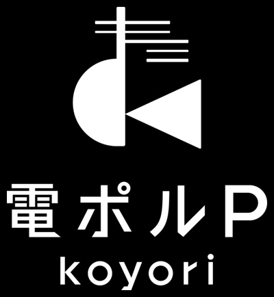  
koyori (Power-Lines-P)  
*Known for: "Loner Envy"*

- About Hatsune Miku

I learned of Hatsune Miku in college.  
My friends were talking about it, and I'd fiddled with digital music a little, so I attempted it as if jumping on the bandwagon.  
Starting with Melt, masterful songs swept the NicoNico Douga rankings, and once I learned most of them were made by a single person with just a computer, I trembled, thought I might be able to do this too, and tried seriously making a song.

I couldn't even conceive that it would lead me to where I am now.

In elementary school, I started playing guitar. In middle school, I became interested in computers.  
In high school, I formed a band, learned about digital music, and made my first song.  
And in college, I met Hatsune Miku.

Now, I often think about how this meeting was, for me, the final, most essential piece of a puzzle.

If I had never met her, my dreams would have ended as only dreams.  
She gave me the power to make my dreams come true.  
No expression of gratitude would be enough, but for this 10th anniversary, let me use this place to say my thanks.

Thank you.  
Please, continue to sing my songs for me.  
Thanks in advance.

- What's your favorite Vocaloid song?

JimmyThumb-P's Fake Lover.  
I remember being knocked out by the first second.  
"You can make a Vocaloid sing with this much emotion?", I thought.  
I don't think any Vocaloid song before or after has given me such an impact.  
A pure band sound, upon which Miku's voice reflects.  
Even now, I still aspire to it. A truly amazing song.

[Fake Lover](http://www.nicovideo.jp/watch/sm6237621)

* * *

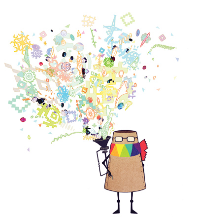  
sasakure.UK  
*Known for: "\*Hello, Planet."*

- About Hatsune Miku

Congratulations to Miku for her 10th anniversary! In the passing of ten years, of course creators, listeners, and their environment will change, but as for myself who's been posting Miku songs since 2007, I'm filled with heartful feelings of "we've come so far..." It's a different world than the future I imagined, but I'm glad she's remained a beloved figure for so long. Please, continue sending your song to many people.

- What's your favorite Vocaloid song?

I have a lot of favorites, so it's very difficult to decide on one. But when I'm hurting or at a loss, I often turn back and listen to baker's "celluloid."  
It was also my first exposure to Vocaloid.

[celluloid](http://www.nicovideo.jp/watch/sm1204327)

* * *

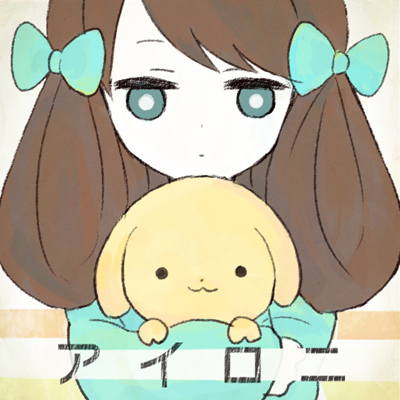  
Scop  
*Known for: "Pinky Promise"*

- About Hatsune Miku

I started composing right around when Miku was born, so I feel like I could do my best alongside Miku's growth.  
I want to tell her thanks for all the opportunities she's given me, and congratulations.

- What's your favorite Vocaloid song?

ODDS & ENDS by ryo (supercell) feat. Hatsune Miku.

I simply like the melody and arrangement as a song, but more than anything, I was struck by the lyrics that focus on Vocaloid.  
Both for a listener or a fellow creator, it's very moving to listen to, and it still stimulates me to do my best every time I listen to it.

[ODDS & ENDS](http://www.nicovideo.jp/watch/sm18626305)

* * *

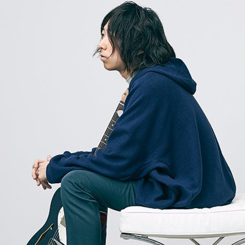  
Chouchou-P (papiyon)  
*Known for: "Eh? Ah, Right."*

- About Hatsune Miku

If I hadn't met this thing called Vocaloid, I may not have ever taken music this seriously, and may not have been continuing with music now.  
She's a valuable partner to me, and I'm really happy to have walked alongside the Vocaloid scene.  
Congratulations on 10 years. And please keep it up.

- What's your favorite Vocaloid song?

I have a lot of favorite songs, but in the sense of "most impactful," I guess it's Melt.  
When Hatsune Miku started becoming popular, I think there were a lot of lyrics directed at Miku, or singing about Miku herself, but starting around the time Melt was posted, I remember that's when the authorship of so-called Vocaloid producers became stronger, and the lyrics changed to something from a creator directed at listeners.  
In that sense too, I think it had a big influence on the culture of Vocaloid.

[Melt](http://www.nicovideo.jp/watch/sm1715919)

* * *

  
Deadball-P  
*Known for: "It's Not About Just Taking Off Your Clothes!"*

- About Hatsune Miku

When I met Miku-chan, I thought "Oh man, everybody's gonna make pervy songs with this, lololol, I'll make them too!" And so I rode that wave and had Miku-chan sing perverted songs.  
But when I took a look around, unfortunately, it turned out people making perverted songs were by far the minority, and the majority were making normal love songs, or chuunibyou songs, etc.  
I couldn't believe this reality. You have a cute girl like Miku-chan who can sing anything, and you won't make her say pervy things? Are you a monk in training? I felt this deep in my heart.  
And so I vowed. "If no one will make these songs, I'll have to have my Miku-chan sing them"... Thus began a painful battle. A worn-down right hand, a hard drive worked to the bone, and a lack of tissues... I endured the harsh conditions and continued to spurt out song ideas from my lower half.

Many times I thought, "nothing more will come out," "I can't get it up anymore," and so I took a rest. But each time, I was made to stand up again by Miku-chan's lisping voice, striped underwear, and exposed underarms.  
As I recklessly put out song after song, I one day noticed the abnormal looks others were giving me.  
Out-there performers, deranged Vocaloid producers, madman singers, zombified record people, and online-stalker fans... before I knew it, many people were watching me and my Miku-chan.

To be honest, I was like "Waugh." Think about it like this: It's like if you opened the window and did squats fully nude, and a huge crowd was peering at you from their windows. That's startling.  
But unfortunately, being watched tends to stimulate me, so my right hand moved ever faster, and inspiration came gushing forth.  
This is how the variety of songs I've posted as Deadball-P came to be. It's thanks to all the weirdos who watched over me as I jerked my way through making songs, and Miku-chan who sang anything for me, even if she didn't look pleased about it.

- What's your favorite Vocaloid song?

"Song of the Sensible Forest / Kagamine Rin Original(?) Song"

I don't know any lyrics more persuasive than this song's. It's a great song that will make anyone who listens to it understand.  
I simply love the "Ahh, that makes seeense..." part.

[Song of the Sensible Forest](http://www.nicovideo.jp/watch/sm2215784)

* * *

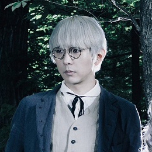  
toku (GARNiDELiA)  
*Known for: "SPiCa"*

- About Hatsune Miku

A new way of musical expression, and a ring of music that deviated and expanded.  
At the center of it all, her voice echoed... That's the kind of 10 years it's been.  
Congratulations on 10 years. I look forward to future evolution.

- What's your favorite Vocaloid song?

"Tell Your World" livetune feat. Hatsune Miku

Hearing this song in Google's TV commercial showing a world centered around Hatsune Miku, I thought it was a fantastic song, that shows how it continues to expand.  
MARiA and I, who now work together with as a unit, also make brief appearances in that commercial.

[Tell Your World](https://www.youtube.com/watch?v=PqJNc9KVIZE)

* * *

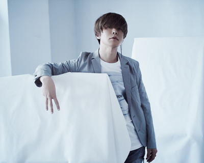  
Nanou (CIVILIAN)  
*Known for: "Hello/Howareyou"*

- About Hatsune Miku

Miku-san, congratulations on your 10th anniversary. I just looked at my Vocaloid songs' Mylist counts on NicoNico, and I posted a total of 13 Vocaloid songs there. I don't mean to exaggerate, but those mere 13 Vocaloid songs changed my life. If the thing known as Vocaloid didn't exist in this world, I think I would have quit music long, long ago. Vocaloid producers I never would have known and couldn't see over the internet, people who lived in different worlds and different genres - it was you, Hatsune Miku, who took all of our disparate points that would never otherwise intersect, and connected them with one line. Thank you so much for being born into this world.

- What's your favorite Vocaloid song?

Maybe it's way too typical, but I would never run out of favorite songs to list, so... I'll choose the song that got me to start Vocaloid. ryo's Melt. First of all, I recall being shocked that some random person online whose face I'd never even seen could upload such a good song, and when I learned about Vocaloid, I bought it quickly after thinking "Maybe I could do this too." At first, Hatsune Miku had a stock shortage, so everyone was yelling about her arriving or not arriving. Ah, that brings me back.

[Melt](http://www.nicovideo.jp/watch/sm1715919)

* * *

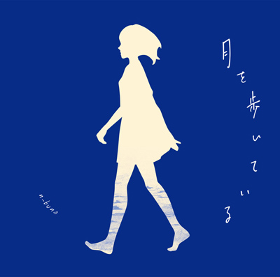  
n-buna  
*Known for: "Sea Lily's Deep Sea Tale"*

- About Hatsune Miku

Thinking about it, I've made music alongside her for years now, so I have an attachment to the software that I can't sum up in so few words.  
Keep going as always. Congratulations on 10 years of Hatsune Miku.

- What's your favorite Vocaloid song?

sasakure.UK's Campanella.  
When I first learned of Vocaloid and started looking into it, I casually watched it and was deeply moved. I still love it.

[Campanella](http://www.nicovideo.jp/watch/sm8639738)

* * *

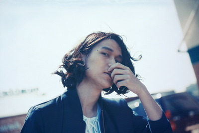  
Nekobolo (Sasanomaly)  
*Known for: "Self-Harm Achromatic"*

- About Hatsune Miku

Congratulations for 10 years of Hatsune Miku. I met her on release when I was in high school. Without exaggeration, the opportunity to make music and the fact I make it in the way I do now is all thanks to Hatsune Miku (and everyone who listened to my songs). Please continue apace.

- What's your favorite Vocaloid song?

Powapowa-P (Shiina Mota)'s Sky Fish.

He was my rival, and he was my friend; this song was how I got to know Powa-kun. I was shocked when I first heard it, and I'll always love it.

[Sky Fish](http://www.nicovideo.jp/watch/sm12110052)

* * *

  
Neru  
*Known for: "Lost One's Weeping"*

- About Hatsune Miku

To everyone involved with Hatsune Miku, congratulations on 10 years. Should I put it like that? I'm a little lost on how to celebrate "the concept of Hatsune Miku," but there are no doubt many wonderful things there. It being such a fascinating culture that it can't even be celebrated in a standard way, I can't help but look forward to a future where it continues to stir up the internet and entertainment.

- What's your favorite Vocaloid song?

Albino, by buzzG.

The lyrics don't gloss over anything, leaving nothing but sheer reality, yet they're powerful and encouraging, which is just the salvation I sought at the time. Themes like that were difficult for the traditional pop scene to handle, so I remember it making me all the more interested in the Vocaloid scene.

[Albino](http://www.nicovideo.jp/watch/sm9485673)

* * *

  
buzzG  
*Known for: "Wrinkle"*

- About Hatsune Miku

Congratulations for Hatsune Miku's 10th anniversary!  
I learned about Hatsune Miku very shortly after release, so it's honestly amazing to think that 10 years have passed since then. I only actually started using her in 2009, so it's been about 8 years since I came to know her. It's been 8 years of joy at meeting a new technology, and full-speed running. Vocaloid, led by Hatsune Miku, breathed life into my music, and taught me new possibilities and ways that music could be.  
I hope she can continue to exist as a source of life for nobodies like me, now and forever.

- What's your favorite Vocaloid song?

I'd love to throw out compliments to many others, but that might seem indecent in a "the grass is always greener" way, so while it's singing my own praises, I'd like to choose one of my own songs.  
Albino, released in 2010.  
Many people regarded this song as a breakthrough - musically, numerically, in every sense. It took quite a while to make, and made me get a strong taste of the pain of childbirth. I would call it the first song where I seriously worked together with Hatsune Miku. I still sometimes listen to it to straighten myself out.

[Albino](http://www.nicovideo.jp/watch/sm9485673)

* * *

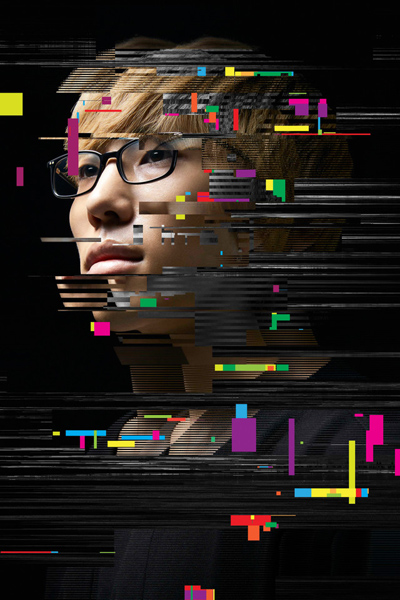  
Hachioji / 8Prince-P  
*Known for: "Sweet Devil"*

- About Hatsune Miku

It was a real experience to be a part of these 10 years which, even as Miku's history goes on, will perhaps remain the most stimulating. Thanks to Miku, I could see a lot of sights I wouldn't normally see. I think I repay the favor to Miku by continuing to make songs, so I'd like to continue on having fun and not straining myself.

- What's your favorite Vocaloid song?

It's reeeally difficult to narrow it down to one, but if I must, I'll say kz's Strobe Nights. I listened to it like crazy before I started making Vocaloid music. There are a lot of high-tempo Vocaloid songs nowadays, but I think I like middle-tempo Vocaloid most.

[Strobe Nights](http://www.nicovideo.jp/watch/sm1657814)

* * *

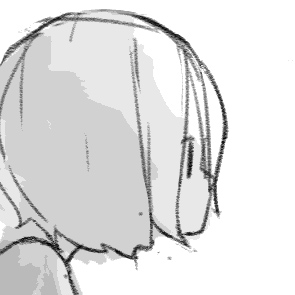  
Harumaki Gohan  
*Known for: "Gingaroku (Galaxy Log)"*

- About Hatsune Miku

Congratulations on 10 years of Hatsune Miku! I'm honestly flabbergasted that it's been 10 years since release already. I still remember hearing Hatsune Miku for the first time in middle school. It's a very strange feeling how nearly 10 years later, I'm active as a Vocaloid producer myself!

- What's your favorite Vocaloid song?

wowaka's My Talent. There are really so many Vocaloid songs I like, but when I go back and listen to the old ones I used to listen to, it feels like this one is best at bringing back my feelings from that time. I remember it somehow made me want to make music myself.

[My Talent](http://www.nicovideo.jp/watch/sm7620150)

* * *

  
halyosy  
*Known for: "Sakura no Ame (Rain of Cherry Blossoms)"*

- About Hatsune Miku

Congratulations! I wouldn't have imagined ten years ago that this day would come in such a way. So much has happened, hasn't it? I'll also see my 10th anniversary of posting this year. Let's keep singing lots into the future. Thank you.

- What's your favorite Vocaloid song?

ryo's Melt. At the time, I would put on this song right after waking up to fill myself with energy for the day. It's a precious song that became the starting point for everything.

[Melt](http://www.nicovideo.jp/watch/sm1715919)

* * *

  
Pinocchio-P  
*Known for: "Sloww Mootion"*

- About Hatsune Miku

I didn't think I liked her that much at first, but before I knew it, it felt like we'd been married all along.  
I think her hair is long. Congratulations on 10 years.

- What's your favorite Vocaloid song?

I can't choose a favorite, but the first song to make me like Vocaloid was Agoaniki's Double Lariat.  
At the time, I thought Vocaloid meant idol songs, so the earthen lyrics and band sound reconstructed that picture.  
That's a Megurine Luka song. Congratulations to Hatsune Miku for her 10 years.

[Double Lariat](http://www.nicovideo.jp/watch/nm6049209)

* * *

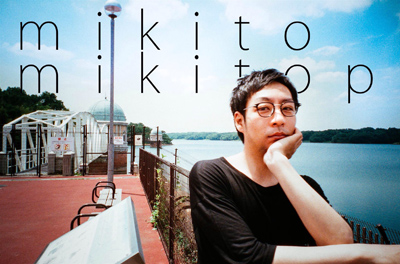  
Mikito-P  
*Known for: "Yie Ar Fanclub"*

- About Hatsune Miku

Hatsune Miku, congratulations on your 10th anniversary!

I met Vocaloid in 2009. At the time, I was searching for some kind of new way to work in music. It felt like something you could start doing even without friends or money, just all on your own. There was times I was uneasy, but even so, I was supported by hope for this unknown world and feelings of enjoyment - thinking about it, it's been a long time together. To my precious friend who cut open the way and shared the opportunity to create, I offer thanks and words of celebration. Congratulations!

- What's your favorite Vocaloid song?

\*Hello, Planet.

\- Because I feel the lyrics and composition are incredibly polished.  
\- Because the aroma of NicoNico Douga in 2009 accompanies this song, which revives both good and bad memories, and somehow fills me with emotion.

[\*Hello, Planet.](http://www.nicovideo.jp/watch/sm7138245)

* * *

  
Mitchie M  
*Known for: "FREELY TOMORROW"*

- About Hatsune Miku

First, congratulations on your 10th anniversary! I started Vocaloid in 2011, so it's only been 6 years, but they've been very fulfilling days even so. Hatsune Miku appeared to me when I was getting passionate for music, and the world of Vocaloid was a very fierce scene. Making music with Hatsune Miku as one of the members in that scene has been more fun than anything prior. I hope to never forget those initial feelings, and intend to still pursue the possibilities of Hatsune Miku, so regards!

- What's your favorite Vocaloid song?

It's difficult to settle on one song, but I love kihirohito's "Defense Girl Sowaka-chan" series and listen to it often. The videos are full of parodies and homages to all kinds of songs, movies, and anime, so it's greatly enjoyable to people who know the references! His Vocaloid songs outside the Sowaka-chan series are fun too, so I personally recommend them.

[Defense Girl Sowaka-chan](http://www.nicovideo.jp/watch/sm1235394)

* * *

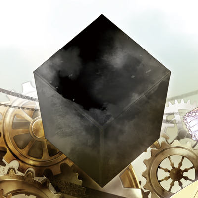  
mothy / Akuno-P  
*Known for: "Servant of Evil"*

- About Hatsune Miku

Happy 10th birthday.  
Hatsune-san, you've become famous, and I've come to see you show up in all sorts of places.  
These ten years have felt so short, yet so long.  
Throughout them, you didn't end as a temporary fad, but established yourself as a standard, and I'm happy as can be about that.  
I pray for your future success.

- What's your favorite Vocaloid song?

Kobayashi Onyx's Saihate.  
This was the song that got me to start making Vocaloid songs.  
I told him as much when I was able to meet with him once before, but perhaps he thought I was just being polite, and thus more or less ignored it.

[Saihate](http://www.nicovideo.jp/watch/sm2053548)

* * *

  
Yuuyu  
*Known for: "Tengaku"*

- About Hatsune Miku

Miku-san, congratulations on your 10th anniversary.  
There's been silence for a while as far as posting videos with my Miku-san, but she continues to work hard with me in a different form now.  
There should be a lot more I want to say, but maybe I don't have to say it in public... So for now, I'll just say, keep it up.

- What's your favorite Vocaloid song?

"Give My Regards to Yotsuya-san" by Eight.

The flow, atmosphere, character, and melody are all very powerful, and I can still remember it all clearly now, quite a while after it was posted.,  
It was like a condensed world akin to the free horror games I played at the time, and it hit me like a knife.  
I like all of Eight-san's songs, but this has to be my favorite.

[Give My Regards to Yotsuya-san](http://www.nicovideo.jp/watch/sm21113325)

* * *

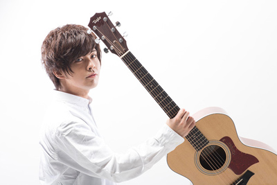  
Yuyoyuppe (DJ/TEKINA//SOMETHING)  
*Known for: "Leia"*

- About Hatsune Miku

I always described it in various places as "software with hidden potential," but when I hear "10th anniversary," I feel like maybe it's not as much like that anymore...  
She feels to me like a person who gave me the opportunity to seriously do music.  
I hope she'll continue for 15 years, for 20 years, giving energy to people all around the world.  
On this occasion, I say congratulations on your 10th anniversary, Miku-san!!

- What's your favorite Vocaloid song?

That's incredibly difficult, but... I think I'd like to choose "Hatsune Miku Sang a Cover of "Saihate.""  
It's kz's cover of Kobayashi Onyx's Saihate. I remember it really shook my emotions at the time. Currently, the two of them have become a pro author and a pro artist, but these at-the-time non-pros making this super-high-quality thing shocked me, and I remember it igniting my motivation.

[Saihate (kz Cover)](http://www.nicovideo.jp/watch/sm3088245)

* * *

  
40mP  
*Known for: "Karakuri Pierrot (Clockwork Clown)"*

- About Hatsune Miku

Miku, congratulations on 10 years!  
If I hadn't met Hatsune Miku 9 years ago, I definitely wouldn't be who I am now.  
*\[I would be remiss not to remind people that 40mP literally met his wife through Vocaloid.\]*  
She's sung for me nearly daily since then, but I hope to continue making many songs with her!

- What's your favorite Vocaloid song?

There are so many, it's hard to say, but if I must give one, it's baker's "celluloid."  
I first heard it only shortly after learning about Vocaloid, and that song is what changed my perception of Hatsune Miku as an idol-like thing to "a thing for independent artists."

[celluloid](http://www.nicovideo.jp/watch/sm1204327)

[Interview List](https://www.vgperson.com/./vocalinterview.php)