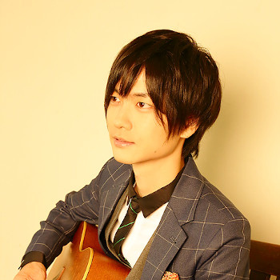

## Nine Vocaloid Producers - Three-Song Vocaloid Selections

Natalie.mu, December 8th, 2020 ([Original Article](https://natalie.mu/music/pp/the_voca_colle02))

### The VOCALOID Collection Special Feature #2: Three-Song Vocaloid Selections, As Chosen By Producers

The VOCALOID Collection ~Winter 2020~, an event involving various projects related to Vocaloid, will be held from December 11th to 13th.

To commemorate the start of The VOCALOID Collection, Natalie.mu will be posting a series of features putting the spotlight on creators supporting the event. For this second article, we surveyed creators taking part in the event to provide three songs they have a strong attachment to, and their reasons.

- OSTER project  
    Known for songs like "VOC@LOID in Love"  
    [OSTER Vtuber Tesro & Roset (@fuwacina) | Twitter](https://twitter.com/fuwacina)  
    [OSTER project Tesro & Roset | YouTube](https://www.youtube.com/c/OSTERproject47)

**1.** [Tokage "Sleaze Dance"](https://www.nicovideo.jp/watch/sm13033415)

I could go on forever talking about things I like about Tokage-san's songs, but one of the big charms is how they effectively incorporate bluesy phrases into catchy pop.  
This song has a super impressive density of that sort of thing...  
In particular, the backing piano in the intro and outro comes in at a miraculously good-feeling part, and if there were more songs like this in the world, I'd smile, so I want there to be. Between the guitar solo that feels like fusion in the interlude, the organ, the horns, the bass, nothing goes to waste in how the instruments are put together, and it feels so good how they attack giving you no time to breathe... It's way too good, people good at making songs make such good songs...

**2.** [Keienu-P "Summer Ends"](https://www.nicovideo.jp/watch/sm31748658)

It starts with a nostalgic intro that make you think of a French film, then makes a sudden turn into an up-tempo song. Yet this isn't a clean split, as the nuance of the intro gets proper use later between the latter interlude and the final chorus. A true testament to Keienu-san's skill...  
Seriously, it's fantastic how well thought-out it all is...  
The way the first verse is in major key, yet there's a building shroud of tragedy, and it gets you by becoming minor key in the chorus is also super good... And when all's said and done, it has such subtle, polished, yet fancy chordwork! Plus the flowing key changes, and the sudden surprising changes in rhythm, it's just really good, this song is so good, people good at making songs make such good songs...

**3.** [Mitchie M "News 39"](https://www.nicovideo.jp/watch/sm26167108)

I'm sure that when people think of Mitchie-san, his amazingness at tuning Miku-san comes to mind, but I'm constantly thinking it's wild how well-made his instrumentals are too. In this song, for instance, I was shocked at his skill at reproducing the "feeling" of news using sound alone, with techniques like 4-note arpeggio sections and synth sequencing all over the place.  
And while he's packing it with that news style, the construction of the sound is still disgustingly cool, and the fact that overall it stands as a catchy idol song is truly impressive, way too good... People good at making songs make such good songs...  
For some reason, I always feel like the progression in this song's chorus is gonna make me cry.

- Niru Kajitsu  
    Known for songs like "Shama"  
    [Niru Kajitsu (@vinegar_vinegar) | Twitter](https://twitter.com/vinegar_vinegar)  
    [Niru Kajitsu | YouTube](https://www.youtube.com/channel/UCkltfvjVoojq0BGRt4pmlig)

**1.** [Jin (Shizen no Teki-P) "Kagerou Daze"](https://www.nicovideo.jp/watch/sm15751190)

This is the song that got me absorbed in Vocaloid. I think of it as my origin point.

**2.** [Balloon "Charles"](https://www.nicovideo.jp/watch/sm29822304)

I want to make a song that can spread as far and be as beloved as this one someday. It's a song I aspire to and hold as a goal.

**3.** [Niru Kajitsu "Traffic Jam"](https://www.nicovideo.jp/watch/sm35586514)

I'm particularly fond of this among all my songs. I do hope you'll give it a listen.

- buzzG  
    Known for songs like "Wrinkle"  
    [buzzG (@buzz_g) | Twitter](https://twitter.com/buzz_g)  
    [buzzG Official | YouTube](https://www.youtube.com/user/buzzGofficial)

**1.** [buzzG "Fairytale,"](https://www.nicovideo.jp/watch/sm18562271)

Sorry to sing my own praises, but this is one of my songs.  
On May 21st, 2012, I observed an extremely rare solar eclipse known as the annular solar eclipse, visible in various places around the world. It's called that when the sun, moon, and Earth are all aligned in a straight line, so the moon and sun overlap, and the sun radiates light in a ring shape.  
"Fairytale," likens the reunion of two people to the moon and the sun in an annular solar eclipse. It's a song about a promise that even if they go far apart, they'll someday be reborn, or perhaps become stars, and be it in hundreds or thousands of years, their reunion will come to pass, like the annular solar eclipse. I believe even an absurd promise such as that which sounds like a fairytale can be a reason for people to live.  
To imbue the feelings of wanting it to be an eternal promise, I ended the title not with a period (an end), but a comma (a continuation).

**2.** [Nuu (Furukawa Honpo) "Moonlight Restaurant"](https://www.nicovideo.jp/watch/nm12411212)

A song I love and have a deep attachment to.  
Furukawa Honpo-san writes very beautiful songs, and is someone I've been influenced by after discovering Vocaloid culture. The lyrics of Moonlight Restaurant are full of rich expressions and have a sense of literature, making me unconsciously want to read them aloud. And when woven with the melody, it's a song that somehow makes tears start to flood over.

**3.** [ryuryu "Juvenile"](https://www.nicovideo.jp/watch/sm32451744)

I truly love ryuryu-san's songs, so I had trouble choosing one, but I ended up on one of my most beloved, Juvenile. A totally transparent-feeling sound, a beautiful melody, and lyrics that were lovely yet somehow transient drew me in. Like a fairy that you can no longer see once you become an adult - it felt like that kind of song.

- Hachioji-P  
    Known for songs like "Fickle Mercy"  
    [Hachioji-P (@8_Prince) | Twitter](https://twitter.com/8_prince)  
    [Hachioji-P | YouTube](https://www.youtube.com/channel/UCD7pKXtQ-ZFixYZp8NYAY1Q)

**1.** [Giga "BRING IT ON"](https://www.nicovideo.jp/watch/sm33510542)

It's just plain cool. I can't get enough of this groovy sound that makes me unconsciously lean forward.  
Giga-chan is one of only a few friends who I go drinking and such with even in my private life. But when we meet, we don't discuss music at all, and I doubt we ever will.

**2.** [baker "celluloid"](https://www.nicovideo.jp/watch/sm1204327)

I knew baker-san before he got his start in Vocaloid, so I was surprised when he started, and have fond memories of getting to perform with him at events and such.  
He even talked with me about my future prospects, so if not for baker-san, I might not have been who I am now.

**3.** [emon(Tes.) "Lucky☆Orb"](https://www.nicovideo.jp/watch/sm35129416)

This is the newest of the songs I've selected here.  
In my book, emon-san's best song was Heart Beats, but Lucky☆Orb ended up surpassing it.  
It was the theme song of Miku Expo, but it brings images of concert hype to mind - it's a song I really love.

- Harumaki Gohan  
    Known for songs like "Melty Land Nightmare"  
    [Harumaki Gohan (@harumaki_gohan) | Twitter](https://twitter.com/harumaki_gohan)  
    [Harumaki Gohan Official | YouTube](https://www.youtube.com/c/harumakigohan)

**1.** [Eight "It Was a Wonderful June"](https://www.nicovideo.jp/watch/sm23770496)

At the time this was posted, I wasn't able to play guitar well at all, and I had less know-how than I do now, so I was seriously wondering what the heck was up with guitars. But this song's intro struck my heart, so I copied it and played it over and over, and realized with delight that maybe you could use guitar like this too. I feel like the Vocaloid songs around that time, starting with this one, shaped the current state of my guitar skills. Even now, I sometimes play the intro without thinking before a recording.

**2.** [Nayutalien "Rocket Cider"](https://www.nicovideo.jp/watch/sm26848673)

This song helps me clearly remember that time when rumor was spreading about this mysterious Vocaloid producer named Nayutalien, and how they were visibly becoming widely-known. Unlike their first song Andromeda Andromeda, this song more closely resembled Rockin' On-style Japanese rock, so I remember talking with some Vocaloid producer friends like "so, Nayutalien likes Rockin' On too."

**3.** [n-buna "Uninhabited Station"](https://www.nicovideo.jp/watch/sm26758712)

A song from "Flower and Starch Syrup, Last Train," released in the summer of 2015. I love this song itself, but I love it as part of the entire album. It locks up within it summery scenes, like how you used to go to granny's house for/during summer vacation each year, and walk through the rice paddies or the paths between them. My other particular favorite songs on the album are "Because Summer Will End Soon," "Ignite, Countdown," and "Before the Night Festival."

- Pinocchio-P  
    Known for songs like "Sloww Mootion"  
    [Pinocchio-P (@pinocchiop) | Twitter](https://twitter.com/pinocchiop)  
    [PINOCCHIOP OFFICIAL CHANNEL | YouTube](https://www.youtube.com/channel/UCMMBGMjrrWcRZmG_lW4jC-Q)

**1.** [Agoaniki "Double Lariat"](https://www.nicovideo.jp/watch/nm6049209)

The song that led to me liking Vocaloid. I was awakened to the appeal of having a Vocaloid sing all-too-human lyrics.

**2.** [wowaka "Unknown Mother Goose"](https://www.nicovideo.jp/watch/sm31791630)

A legendary song wowaka-san created by diligently facing Vocaloid head-on. I imagine the lyrics "You, left behind (...) why, oh why?" as being sung about himself.

**3.** [aibon (Kancopy-P) "Encouragement Song"](https://www.nicovideo.jp/watch/sm2096153)

A piece of crap song that symbolizes the deep tolerance of Vocaloid culture. I want it to be performed at Magical Mirai.

- marasy  
    Known for songs like "cat's dance"  
    [marasy (@marasy8) | Twitter](https://twitter.com/marasy8)  
    [marasy8 | YouTube](https://www.youtube.com/c/marasy8)

**1.** [Kurousa-P "Senbonzakura"](https://www.nicovideo.jp/watch/sm15630734)

I love the song, my piano performance of it has gotten a lot of views, and above all, I got to perform it on piano for a Toyota Aqua commercial, so it's a very meaningful song to me.  
The piano is played in a very, very cool way, and it's incredibly fun.  
It seems a lot of people came to know about me thanks to it, so it's a precious song I owe many wonderful outcomes to!

**2.** [kemu "A Tale of Six Trillion Years and a Night"](https://www.nicovideo.jp/watch/sm17520775)

This is another song I really love.  
With a super cool yet tragic melody and lyrics and tone, it's just the best all around.  
Performing the intro and interludes on piano gets me really pumped up!  
kemu-san has been a friend of mine for a decade, and the other day, he bestowed upon me the title "Six Trillion Years Master." Heck yeah.

**3.** [marasy "Heavenly Kitsune"](https://www.nicovideo.jp/watch/sm18605244)

I made this song myself, but it's a big favorite and has a lot of memories attached to it, so I selected it anyway.  
It initially came about solely because I wanted to put fox ears on Rin-chan, but it's been included in Project Diva and Project Mirai, been sung by Yoko Takahashi-san, had a novel written for it... It's a song that's given me many wonderful experiences.

- 40mP  
    Known for songs like "Love Trial"  
    [40mP / Tooru Iname (@40mp) | Twitter](https://twitter.com/40mp)  
    [40meterP | YouTube](https://www.youtube.com/channel/UCG09qajPDZdPtLsTkW7mJQA)

**1.** [kz "Finder"](https://www.nicovideo.jp/watch/sm1952223)

Around the summer of 2008, when I didn't know much about Vocaloid, I remember finding this song on NicoNico Douga, and being moved by the voice of Hatsune Miku vibrantly singing this beautiful melody.  
It led me to step into the Vocaloid scene myself, and is still a beloved song of mine.

**2.** [OneRoom (JimmyThumb-P) "from Y to Y"](https://www.nicovideo.jp/watch/sm6529016)

While it's often the trend for Vocaloid songs to be intense rock or dance tunes with a good beat, I think this song took the world by storm as a ballad simply because the lyrics and melody pulled at listeners' heartstrings.  
I'm personally very fond of JimmyThumb-P-san's Miku tuning, which has a lightness like a sigh on a winter morning, and I feel that voice especially shines in this song.

**3.** [buzzG "Wrinkle"](https://www.nicovideo.jp/watch/sm17763107)

In part because I had just been married at the time the song released, I found many phrases that resonated with me and listened to it over and over.  
I've even posted my own cover singing this song - the feeling of liberation in the chorus makes it a catchy melody I find myself wanting to hum.

- ryo (supercell)  
    Known for songs like "Melt"  
    [ryo (@ryo_spcl) | Twitter](https://twitter.com/ryo_spcl)  
    [spcl ryo | YouTube](https://www.youtube.com/channel/UCy9UVm-UjHqcktvxg-sS4qQ)

**1.** [cosMo@Bousou-P "The Disappearance of Hatsune Miku"](https://www.nicovideo.jp/watch/sm1476648)

First off, the piano riffs that drive a racing feeling across the board are very impactful. Following this song, songs with piano riffs like this have continued to show up a lot in the Vocaloid scene and in current trendy songs. Even time I hear such riffs in places, I feel the amazing influence of cosMo-san's songs. It should be more acknowledged all across Japan. Also, when I think about the state of making digital music at the time, merely the way it replicates an electric guitar digitally is amazing. There are plenty of electric guitar synths now, of course, but about the only one I can remember there being at that time was MusicLab's RealGuitar. Incidentally, this has an acoustic guitar synth, but makes use of an amp-simulating plugin to make it sound electric - also a technique that ended up sweeping the Vocaloid scene to come.

**2.** [Utata-P "Stratosphere (Long ver.)"](https://www.nicovideo.jp/watch/sm1613775)

At the time, I liked this song so much I listened to it every day. Listening to it after so long now makes me remember those days and feel like crying. The comments on it are the same as they ever were, and even moreso than the song itself, I might say listening to this song alongside these comments was more emotional for me than anything back then. Regarding the song: a lot of old trance songs threw in more vulgar riffs to hype things up, but the consistent synth riffs in the backing track and the looping melody in this song are so beautiful, and the TB-303-esque bass sound has links to acid house music - this song has a lot of virtues all its own that go beyond simple trance. After this, trance was almost entirely absorbed by EDM, and across the entire music scene, basically all the trance DJs there were at that time moved to EDM. And many DJs found success in the EDM scene too. You could say that demonstrates the technical skills of people who make trance. From what I recall, I think this song was the first time something Hatsune Miku sang was made into a CD. I remember going to buy it because an Akihabara PC parts shop or something said they had it for limited release, but being unable to get it.

**3.** [ika_mo "I'll Make You Miku-Miku♪"](https://www.nicovideo.jp/watch/sm1097445)

ika-san registering this song with JASRAC made the video blow up like nothing else had in all of history. Of course, part of it was that there was a lot of hate toward JASRAC. But registering with JASRAC meant making money - in other words, becoming a pro - and NicoNico itself actually had a rule against posting commercial videos, so that was one of the causes. This mega-popular song ended up stalling out because of that commotion. At the time, there were few examples of Vocaloid producers switching over to a commercial basis - certainly not many in 2008, and maybe as many as you could count on one hand in 2009. So Vocaloid producers trying to do commercial work all had this belligerent hostility in the forefront of their minds.

That said, I myself sought to make a major debut, AKA switch over to a commercial basis. So first things first, I went to NicoNico Douga headquarters to greet them, and confirm whether my currently-posted videos would switch from a hobbyist basis to a commercial basis, and whether I should independently delete my videos. Their answer was that NicoNico Douga wouldn't change the rules and tacitly let it slide, so there was no need to go as far as deleting them. And regarding the JASRAC issue, it was suggested that by way of a partial fiduciary contract, users could enjoy things they way they had been, making fanworks even without permission as long as they didn't have a commercial basis. And from then on, most Vocaloid producers who would do work in a commercial basis made use of this approach. However, there was a downside to this: no matter how much people sang at karaoke, for instance, the Vocaloid producer wouldn't get a single yen. Since Vocaloid songs occupied much of the top karaoke rankings at the time, I imagine people could have made huge amounts of money if they'd had a full contract.

Come 2011 or so, as if it were completely forgotten there had been such a conflict, it became normal for Vocaloid producers to make full contracts with JASRAC and have major debuts. And at the same time, the consumer-generated-media culture once expected of the Vocaloid sphere all but vanished, and the newfangled relationship of "listeners and Vocaloid producers" assimilated into the arrangement of "artists and fans" that's long existed in the music industry. Now, there are in fact lots of people who tell me "I checked with JASRAC and it wasn't registered there, so I've come to get permission directly." These days, I feel like those who have full contracts with JASRAC probably have a more convenient time. And yet even now, even where I am, I still think about it. How all Vocaloid producers who do commercial work owe the maximum amount of thanks to ika-san. Because of ika-san paving the way and enduring that flaming alone, the Vocaloid producers to come and their listeners could face each other, and as a result, Vocaloid producers are now able to make big waves in Japanese society. I've never had a way to thank ika-san directly, so I apologize for using this space for it, but ika-san, truly, thank you so much.

[Interview List](https://www.vgperson.com/./vocalinterview.php)