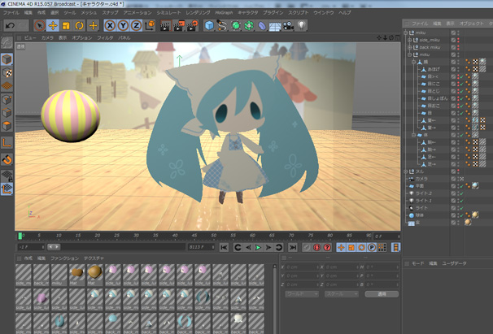
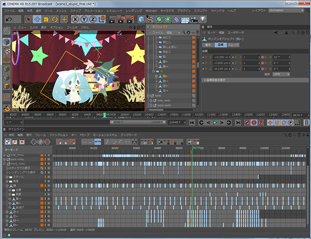
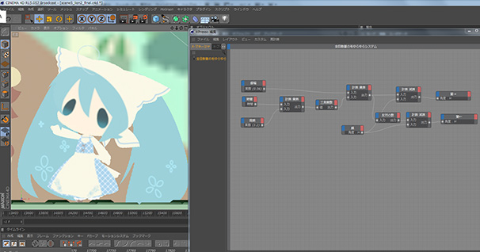
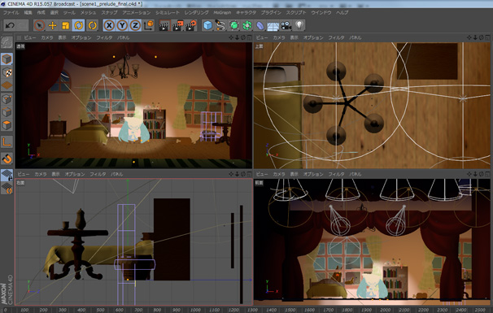

## OSTER project - Attractive Museum

KAI-YOU, April 21st, 2014 ([Original Article](http://kai-you.net/article/4708))

### Asking OSTER project of the First Generation of Vocaloid Producers: What is a "Vocaloid Musical"?

**OSTER project** is a Vocaloid producer who began posting music online in 2000, and who has consistently remained at the top of the Vocaloid scene from its dawn in 2007 up to the present.

In recent years, she's extended beyond her own Vocaloid songs to compose and produce for other artists, hold concerts, and make PVs, becoming a more diverse creator.

OSTER's new album **Attractive Museum,** long-awaited by fans, will release on April 23rd (Wednesday).

This is a best-of album with renewed versions of Vocaloid music by OSTER from the 2010s.

Of particular note is the latest entry in OSTER's newly-pioneered genre, the "Vocaloid musical": **The Music Wizard of Oz.**

A Vocaloid musical is just as the name implies: a song structured like a musical with Vocaloid characters singing and playing roles. This is the second such musical, continuing from the 2010 song **Alice in Musicland.**

In this series where OSTER oversees not only the music but the video herself, both the quality of the music and also of the production keeps fans' eyes glued to the screen. Not to mention that this song surpasses its 10-minute predecessor with a length of about 20 minutes.

We conducted an interview focused on The Music Wizard of Oz in search of OSTER project's creative quintessence.

- I Can Keep Going Because There's Excitement in Any Era

- <r>Attractive Museum is a best-of collection from the 2010s. In your decade of activity, it's been a period of much change for you, hasn't it?</r>

**OSTER:** I feel like there's some kind of change in me every year, but starting around 2010, I feel like I've been making more cool and rock and full-orchestra songs than cute ones.

- <r>Was it due to some change in your thinking?</r>

**OSTER:** Until then, I'd made roughly 50/50 cute songs and cool songs. But at the start, I made polished instrumental songs. I think the thought of going back to those again served as an opportunity.

Also, I think it's good not to be stuck with certain genres, so I consciously create songs for various tastes to keep a balance. Like, "Before this was a cute one, so let's make this one cool."

- <r>Speaking of instrumentals, in 2013 you contributed to the Bemani series.</r>

**OSTER:** That's right. That was pretty well tied to my motivation to go to instrumentals.

- <r>What would you say about your motivation which has lasted over ten years?</r>

**OSTER:** Well, I think I can keep going because **no matter the era, there's some excitement to keep me going**.

When I come across music I really like, or take in some new technical skill, or jump into a new movement... I think the stimulation I get from those moments keeps my motivation up.

- The Beginning of Vocaloid Musicals

- <r>Well, Vocaloid musicals seem like a new movement that you created in the 2010s, OSTER. And Alice in Musicland (hereafter just "Alice") was the beginning. Why did you think to make that song?</r>

**OSTER:** Alice was the last song for my album Cinnamon Philosophy. When I was putting together the tracklist for that album, I decided to add two new songs.

The first was a song called "HAPPY FLOWER SHOOOOOP!!", but I decided the other should be a song that **filled in the remaining ten minutes of space** on the CD-ROM.

If I was going to make a ten-minute song, I wanted to do something interesting, so I thought "I know, I'll make a musical!", and then I made Alice.

- <r>It doesn't seem like "musical" is the most obvious leap there. Do you generally like musicals?</r>

**OSTER:** I've always liked Disney movies. And the musical elements of those are strong. I aspired to that, and thought I'd try my hand at it too.

- <r>The ten-minute length of Alice was a surprise, but the second Vocaloid Musical, The Music Wizard of Oz (hereafter Oz) took it to twenty. Why did it balloon to such a volume?</r>

**OSTER:** After making Alice, there were a few points left to consider.

First of all, I wanted to structure it in a way that made the **story easier to understand**, and so viewers could **take more away from it**. And as I considered what songs would be necessary for that, it just casually got into double digits. (laughs) Going too long would bore people, so I condensed as much as I could and settled at that length.

- <r>With more than ten songs, you could make an album of just that.</r>

**OSTER:** That's about how many songs real musicals have, too. So Oz took about the same amount of energy as to create a whole musical!

- <r>Why did you pick the story of The Wizard of Oz to base it on?</r>

**OSTER:** To make things easy to understand, I felt it was best to make the motif a story that everyone knew.

Not only that, but just like in Alice, I wanted each character to get a chance in the spotlight. In that regard, The Wizard of Oz establishes each character and involves them in the story, so it was a good choice.

- <r>Were there any works you referred to?</r>

**OSTER:** I ran through the summary of the original story dozens of times, and I saw the Wizard of Oz show at Sanrio Puroland. Sanrio Puroland's shows neatly summarize stories into thirty minutes, so it helped as a reference for what I could cut and so on.

- <r>About how long did production take?</r>

**OSTER:** The music took two months, and the video over six.

- <r>That's a long time...!</r>

- Making of The Music Wizard of Oz

- <r>The video took a long time to produce, but the increase in quality is very evident. Was the video creation another point of concern after Alice?</r>

**OSTER:** I started using editing software called After Effects around 2009 to make videos, but it hits its limit when making 3D-esque productions, so I had to make a lot of concessions in Alice.

But this time I wanted 3D, and I didn't want to compromise. So I bought CG software called Cinema 4D and **learned everything about it from scratch** while making the video.

- <r>Learning new software just to make Oz... That's impressive... What was the biggest difficulty?</r>

**OSTER:** The thing that took up the majority of the work time was character movements. With limited numbers of joints and expressions, it was tough to think of movement to match the lyrics...

In terms of the workflow, I first asked YOjisan to draw front, side, and back pictures of all the characters. But not just single pictures - I had him have the facial expressions, arms, hair, and other parts divided into layers. I'm sure this was a lot of work, but he did his best.

Then I took those and built the characters in the 3D software part by part. That took quite a while...

From there, to make the characters actually move, I designated **keyframes** for each part. These light blue sections specify the angle of each part, and by putting it all together, the characters appear to be moving. Both music and videos have this kind of steady work in common, I'd say.

It was mostly doing manual work on every part one at a time, but doing absolutely everything manually was just too much. I could automate some parts using a function called **Xpresso** and writing a movement program, which made my work much easier.

- <r>Err, was this really your first time with 3D? Because it really doesn't look that way...</r>

**OSTER:** I studied programming in college, so that was probably a big help.

Also, the dull work of inputting keyframes just didn't feel creative at all, so it was a lot easier to visualize this way. (laughs)

- <r>It's a real surprise to learn that those adorable characters were being moved so systematically behind the scenes!</r>

- <r>What do you think you did especially well on, and want attention given to?</r>

**OSTER:** The lighting effects and such, which make it feel almost like a real stage.

The lighting plan for this was done by my friend **Usagi**, who gave me light source position and movement directions. She studied stage production in college, so it came out looking **quite realistic**.

I also was very particular about **the laser effects in Gumi's part**, so pay attention to those!

- Aspiring to Have Multiple Talents

- <r>You're certainly more multi-talented than simply being a Vocaloid producer. Why did you want to start doing videos yourself in the first place?</r>

**OSTER:** I asked artists for wonderful illustrations, but it felt like a waste not to have anyone moving. I wanted to make proper PVs, and I liked having videos to watch, so I started doing them.

- <r>On NicoNico Douga, very often the song and PV are made by different people. Have you not thought of asking someone else to just do the video?</r>

**OSTER:** Certainly I'm not an expert with videos, and I've got a lot to learn in many areas, so sometimes I want to leave some things I could ask to others. But I don't have that many acquaintances I could ask. (laughs)

On top of that, making them myself allows me to **fully realize my ideals**. Particularly in Oz, the more important the song, the more I wanted that part of the video to be carefully-made.

- <r>Oz feels to me like a work that could have not Vocaloids, but humans performing it as a musical. Are you at all interested in something real people would appear in?</r>

**OSTER:** **Of course.** Alice and Oz both call themselves musicals, but they're only song parts, so strictly speaking they're probably in a "musical-esque" state. **If I could someday include dialogue and make a more charming work,** that would be nice.

- <r>I think you've done quite a lot in the Vocaloid scene. What thoughts bring you to continue using Vocaloid?</r>

**OSTER:** When you want to express something with music, and you have an artist sing it for you, it inevitably carries the image of being "a song by that artist."

But with Vocaloid, people don't get that image and can listen to it as "an OSTER project song." Vocaloid has a definite attraction as **a tool for directly communicating a maker's intention to listeners**. You can have them sing some real harsh stuff, too. (laughs)

- <r>That whiplash is certainly one of your charms. (laughs) Incidentally, how do you generally choose Vocaloids?</r>

**OSTER:** In my case, I see Vocaloids as singers more than characters. Like any singer, they either fit or they don't. It's similar to that. "Given this style, would having this person sing have a good taste to it?" "Maybe if I have that one sing, it'll turn out like this." I imagine stuff like that to make my choices.

- <r>How are you going to proceed as the multi-talented OSTER project?</r>

**OSTER:** I think I might be in a "broad but shallow" stage right now. I want to start getting more "broad and deep."

I deliberately try to gradually get rid of my weak areas, So to make people think "**I can count on her**" no matter the field - that's ultimately the kind of creator I want to be.

[Interview List](https://www.vgperson.com/./vocalinterview.php)